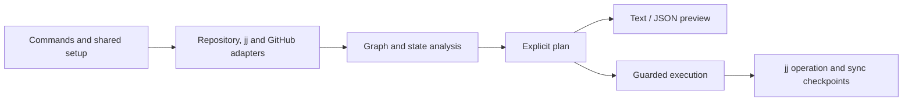

# Behavior and architecture

jj-stacked (`jjk`) manages GitHub pull requests for Jujutsu bookmark stacks. Go, Cobra, and the existing graph UI are the supported implementation. User-facing instructions live in [the usage guide](docs/usage.md); this document records the behavior maintainers must preserve.

## Stack model

- A local user bookmark identifies a PR head. A segment contains the changes since its nearest downstack bookmark or the selected trunk.
- Linear segments may form branching stacks. Bookmarks containing or descending from unsupported merge commits are excluded and reported.
- Traverse each segment to its actual boundary; there is no fixed ancestry cutoff.
- Push state compares every bookmark against the selected Git remote. Another remote, including `@git`, cannot stand in for it.
- Use full commit identities for reviewed cleanup targets. Change IDs can resolve rewritten surviving segments, but divergent change IDs require explicit disambiguation.

## Command contracts

| Command | Contract |
| --- | --- |
| default / `analyze` | Show the graph; `--json` provides structured analysis. `--no-fetch` uses existing tracking state. |
| `submit [bookmark]` | Fetch the selected remote, push the bookmark and its dependencies, create missing PRs, and update existing bases and stack comments. Never close unrelated PRs. |
| `sync [bookmark]` | Fetch, review contiguous merged cleanup, rebase surviving segments, push, and refresh existing PRs. A bookmark selects its connected stack; omission selects all stacks. |
| `prune` | Review local bookmark removal or old draft abandonment. The default scope is merged bookmarks. |
| `abandon --diverged` | Require an explicit keeper for each chosen divergent change; abandon the other commit variants. |
| `status` | Print a table or JSON from local tracking facts. Fetching and GitHub PR lookup are explicit options. |
| `doctor` | Report effective configuration and recovery problems. Online authentication checks require `--github`. |
| `open [bookmark]` | Open the associated PR, or print its URL with `--url`. |

Bookmark inference prefers a bookmark at `@`, then the nearest bookmarked descendants, then the nearest bookmarked ancestors. Multiple candidates require a terminal selection or an explicit argument in scripts. Never infer a divergent keeper by age.

An unchanged PR base or rendered navigation comment requires no GitHub write. Comment ordering must be deterministic. Refreshing existing PRs must not plan pushes, new PRs, or closures.

## Cleanup and recovery

A merged PR is positive cleanup evidence only when its recorded head SHA matches the current local target. A reused or extended bookmark retains its new work. Closed PRs and missing remote branches do not establish that their changes are disposable.

`prune --merged`, `--closed`, and `--missing-remote` use local bookmark **forget**, preserving changes and avoiding a queued remote deletion. Missing-remote candidates also require a prior PR so unpublished work is not classified as a deleted remote branch. Remote evidence requires a successful fetch of the selected remote.

Stale cleanup uses committer age as a review filter. Default candidates are mutable heads outside remote and workspace ancestry; `--revision` allows an explicit draft range. Preview descriptions, references, parents, changed files, and affected descendants. Protect immutable history, remote history, every workspace, and retained divergent versions. Abandonment reparents descendants onto the abandoned change's parents; it does not transplant them onto a retained divergent sibling.

Interactive cleanup requires selection and a default-no confirmation. Scripts must supply an explicit scope and `--yes`; divergent abandonment additionally requires `--keep`. `--json` always reports without applying cleanup. Reject an intervening jj operation or changed bookmark target before applying the reviewed plan. Print the starting jj operation and restoration command before mutation. Do not run cleanup while sync recovery is pending.

Sync may abandon exact merged segments only after checking identities, landing evidence, and the affected descendant paths. Direct landing evidence includes a PR targeting the selected trunk and its actual merge commit present in fetched trunk. Dependency evidence must use verified local ancestry into a landed head; merged names and timestamps alone are insufficient. Unknown destinations or merges newer than the fetch preserve/block cleanup. GitHub documents the post-merge SHA for normal, squash, and rebase merges in its [pull request API reference](https://docs.github.com/en/rest/pulls/pulls?apiVersion=2022-11-28#get-a-pull-request). Preserve or block work outside its planned rebase coverage. Save survivor bookmarks for PR refresh even when the original selection is removed. In-trunk bookmark cleanup forgets the local name. Plans lacking the exact cleanup identity data must stop with abort-and-replan guidance.

Sync stores recovery state atomically, records completed steps, and supports `--continue` and `--abort`. Local restoration cannot undo completed remote pushes or GitHub edits. Do not imply otherwise.

## Dry runs and network access

Dry runs omit planned cleanup, rebase, push, and GitHub writes. Commands may still snapshot working-copy changes, fetch remote state, and query GitHub to build an accurate preview. They are not an offline or zero-local-operation mode. `status` and `doctor` default to local inspection; `analyze --no-fetch` skips fetching.

## Implementation boundaries

- `internal/jjutils`: jj queries, full identities, remote tracking, graph construction, and mutation primitives.
- `internal/github`: GitHub API conversion and operations. Normalize merged state from the list API's merge timestamp.
- `internal/repo` and `internal/commands/common`: repository discovery, effective environment/flags, logging, and terminal selection. Local discovery must not authenticate.
- `internal/submit`: analysis, typed action results, direct submission and refresh planning, and execution.
- `internal/sync`: merge classification, survivor/rebase planning, validation, and durable recovery.
- `internal/cleanup`: explicit local cleanup candidates, operation validation, and execution. No daemon, rules engine, or database.
- `internal/ui`: the live graph viewer. Unused alternate UI workflows should not be retained speculatively.

## Configuration and compatibility

The usage guide owns the environment-variable reference. Honor `JJ_PATH` consistently, including discovery and completion. Explicit `--debug=false` overrides `JJ_STACK_DEBUG`; inherited flags work before or after subcommands. `--no-color` applies to all commands.

Remote selection is explicit `--remote`, otherwise `origin`, otherwise the sole configured remote. Ambiguous selection fails with guidance. Authenticated commands use the repository's GitHub default branch unless `TRUNK_BRANCH` overrides it; never silently guess after a failed API lookup.

Keep jj 0.27.0 compatibility. CI installs pinned jj 0.27.0 and 0.44.0, verifies the executable, and runs real repository tests on Linux and macOS. Use temporary repositories and local bare remotes for mutation tests, and HTTP fixtures for GitHub behavior. Tests must not write to hosted repositories. Run formatting, lint, build, and the race-enabled suite before delivery.

Updater checksum validation, staged replacement/rollback, package-manager handling, GitHub Enterprise support, and shell completion remain supported. Changes here do not require a new architecture.
